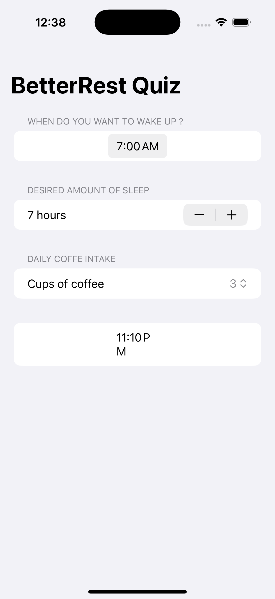
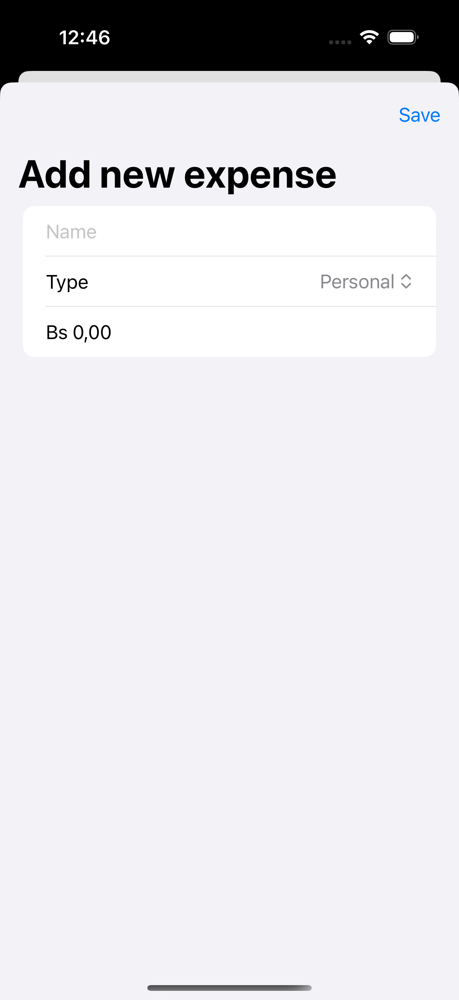
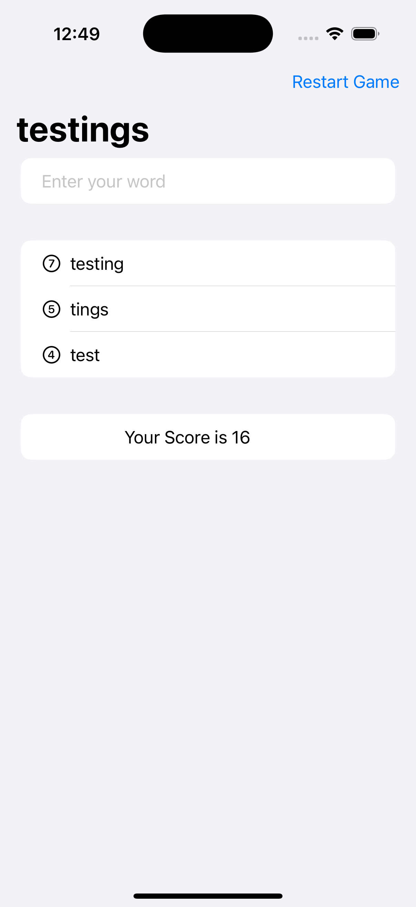
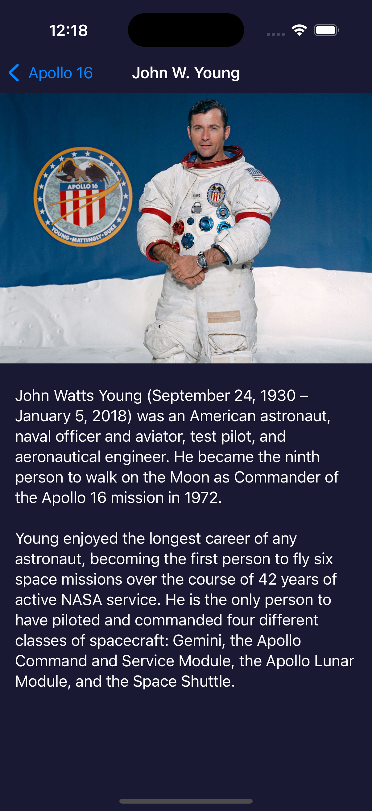

# ¡Bienvenido a 100 Días de SwiftUI!

[English](./README.md) | [Español](./README.es.md) | [Français](./README.fr.md) | [日本語](./README.jp.md)

 

    
    

 

¡Bienvenido a **100 Días de SwiftUI**! Aquí emprendemos un viaje para dominar SwiftUI juntos. Este desafío integral ofrece una gran cantidad de recursos, incluyendo videos, tutoriales, pruebas y más, todo seleccionado de mi trabajo en Hacking with Swift.

Este desafío está diseñado para principiantes que aspiran a construir aplicaciones reales para iOS pero luchan por encontrar un curso adecuado y gratuito. Si eres uno de ellos, ¡bienvenido a bordo! Vamos a sumergirnos en SwiftUI y liberar tu potencial en el mundo de iOS.

¿Listo para empezar? [¡Únete aquí!](https://www.hackingwithswift.com/100/swiftui)

## Apps

## 1. BetterRest
Una aplicación simple de sueño que calcula la hora ideal para dormir según la hora de despertar, las necesidades de sueño y la cantidad de tazas de café consumidas.

## Capturas de Pantalla

| **Inicio** |
|:-----------------------:|
|  |

## 2. GuessTheFlag
Un juego simple que reta a los usuarios a adivinar la bandera de un país a partir de una lista de opciones.

## Capturas de Pantalla

| **Inicio** |
|:-----------------------:|
|  |

## 3. iExpense
Esta aplicación permite a los usuarios realizar un seguimiento de sus gastos y categorizarlos como personales o de negocios.

## Capturas de Pantalla

| **Inicio** | **Agregar Gasto** |
|:-----------------------:|:-----------------------:|
|  |  | 

## 4. WordScramble
Esta aplicación es un simple juego de palabras que reta a los usuarios a crear palabras a partir de una palabra dada.

## Capturas de Pantalla

| **Inicio** |
|:-----------------------:|
|  | 

## 5. MogiClima
Esta aplicación es un simple conversor que permite a los usuarios convertir entre Celsius y Fahrenheit.

## Capturas de Pantalla

| **Pantalla de Inicio** |
|:-----------------------:|
|  |

## 6. MultiplyApp
El diseño es una simple aplicación de fragancias que permite a los usuarios ver fragancias, ver detalles de fragancias y agregar fragancias al carrito.

## Capturas de Pantalla

| **Pantalla Inicial** | **Pantalla de Juego** |
|:-----------------------:|
|  |  |

## 7. Moonshot
La aplicación es un simple directorio de astronautas que permite a los usuarios ver astronautas y misiones.

## Capturas de Pantalla

| **Pantalla de Inicio** | **Detalles de la Misión** | **Detalles del Astronauta** |
|:-----------------------:|
|  |  |  |