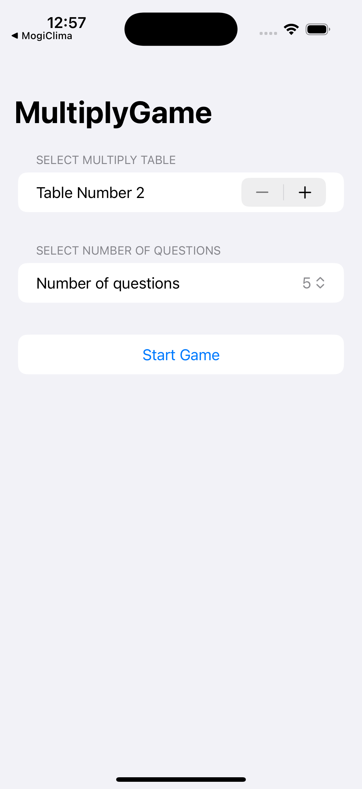
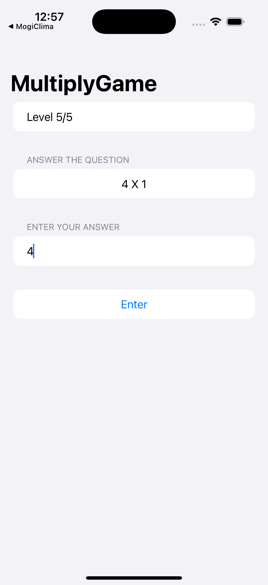
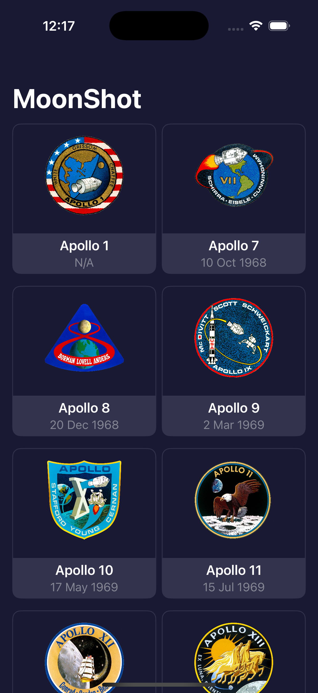
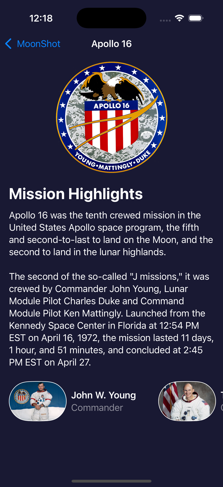

# Bienvenue à 100 Days of SwiftUI !

[English](./README.md) | [Español](./README.es.md) | [Français](./README.fr.md) | [日本語](./README.jp.md)

 

    
    

 

Bienvenue à **100 Days of SwiftUI**, où nous nous embarquons dans un voyage pour maîtriser SwiftUI ensemble ! Ce défi complet offre une multitude de ressources, notamment des vidéos, des tutoriels, des tests, et plus encore, le tout sélectionné parmi mon travail sur Hacking with Swift.

Ce défi est adapté aux débutants qui aspirent à construire de véritables applications iOS mais qui peinent à trouver un cours adapté et gratuit. Si vous en faites partie, bienvenue à bord ! Plongeons dans SwiftUI et libérons votre potentiel dans le monde iOS.

Prêt à commencer ? [Rejoignez-nous ici !](https://www.hackingwithswift.com/100/swiftui)

## Apps

## 1. BetterRest
Une application simple de sommeil qui calcule l'heure idéale pour se coucher en fonction de l'heure de réveil, des besoins en sommeil et du nombre de tasses de café consommées.

## Captures d'écran

| **Accueil** |
|:-----------------------:|
|  |

## 2. GuessTheFlag
Un jeu simple qui défie les utilisateurs de deviner le drapeau d'un pays à partir d'une liste d'options.

## Captures d'écran

| **Accueil** |
|:-----------------------:|
|  |

## 3. iExpense
Cette application permet aux utilisateurs de suivre leurs dépenses et de les classer en tant que personnelles ou professionnelles.

## Captures d'écran

| **Accueil** | **Ajouter une dépense** |
|:-----------------------:|:-----------------------:|
|  |  | 

## 4. WordScramble
Cette application est un simple jeu de mots qui défie les utilisateurs de créer des mots à partir d'un mot donné.

## Captures d'écran

| **Accueil** |
|:-----------------------:|
|  | 

## 5. MogiClima
Cette application est un simple convertisseur qui permet aux utilisateurs de convertir entre Celsius et Fahrenheit.

## Captures d'écran

| **Écran d'accueil** |
|:-----------------------:|
|  |

## 6. MultiplyApp
Le design est une application simple de parfums qui permet aux utilisateurs de voir les parfums, de voir les détails des parfums et d'ajouter des parfums au panier.

## Captures d'écran

| **Écran initial** | **Écran de jeu** |
|:-----------------------:|
|  |  |

## 7. Moonshot
L'application est un simple annuaire d'astronautes qui permet aux utilisateurs de voir les astronautes et les missions.

## Captures d'écran

| **Écran d'accueil** | **Détails de la mission** | **Détails de l'astronaute** |
|:-----------------------:|
|  |  |  |
