# 100 Days of SwiftUIへようこそ！

[English](./README.md) | [Español](./README.es.md) | [Français](./README.fr.md) | [日本語](./README.jp.md)

 

    
    

 

**100 Days of SwiftUI**へようこそ！ここでは、一緒にSwiftUIをマスターする旅に出ます。この包括的なチャレンジには、Hacking with Swiftでの私の仕事から選ばれたビデオ、チュートリアル、テストなど、多くのリソースが用意されています。

このチャレンジは、実際のiOSアプリを構築したい初心者を対象としていますが、適切で無料のコースを見つけるのが難しい場合もあります。あなたがその1人なら、歓迎します！一緒にSwiftUIに飛び込んで、iOSの世界でポテンシャルを解き放ちましょう。

さあ、始めましょうか？[こちらから参加してください！](https://www.hackingwithswift.com/100/swiftui)

## アプリ

## 1. BetterRest
目覚めの時間、睡眠の必要時間、消費したコーヒーのカップ数に基づいて理想的な就寝時間を計算するシンプルな睡眠アプリです。

## スクリーンショット

| **ホーム** |
|:-----------------------:|
| 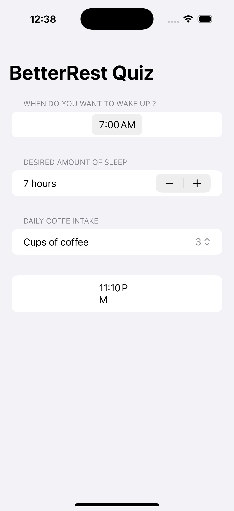 |

## 2. GuessTheFlag
ユーザーがオプションリストから国の旗を当てるシンプルなゲームです。

## スクリーンショット

| **ホーム** |
|:-----------------------:|
| 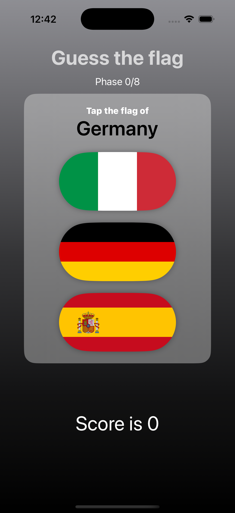 |

## 3. iExpense
このアプリは、ユーザーが支出を追跡し、それを個人またはビジネスのカテゴリに分類できるようにします。

## スクリーンショット

| **ホーム** | **費用追加** |
|:-----------------------:|:-----------------------:|
| 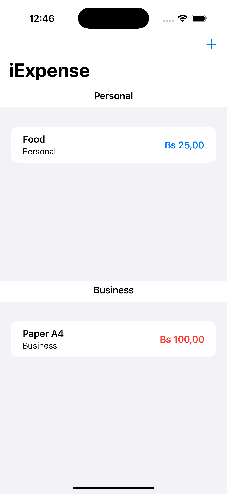 | 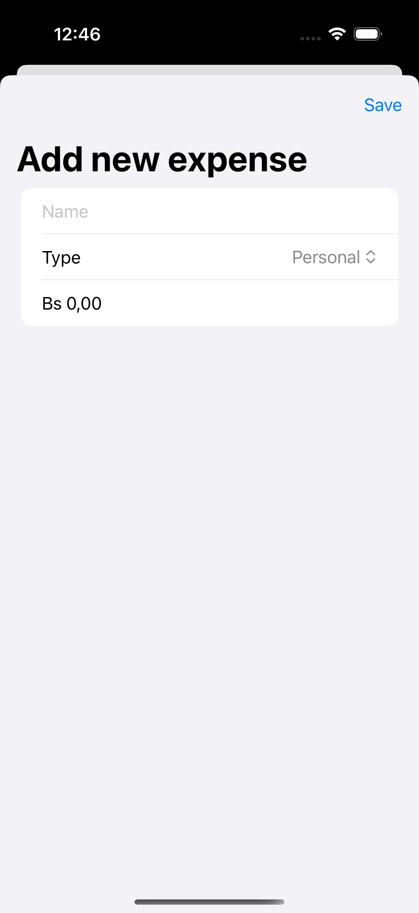 | 

## 4. WordScramble
このアプリは、ユーザーが与えられた単語から新しい単語を作成するシンプルな単語ゲームです。

## スクリーンショット

| **ホーム** |
|:-----------------------:|
| 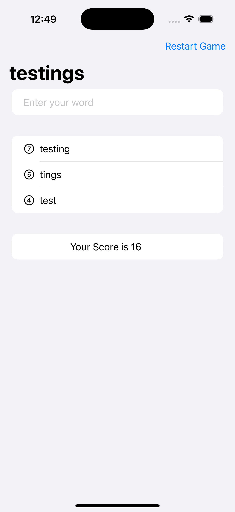 |

## 5. MogiClima
このアプリは、ユーザーが摂氏と華氏を相互に変換できるシンプルなコンバータです。

## スクリーンショット

| **ホーム画面** |
|:-----------------------:|
| 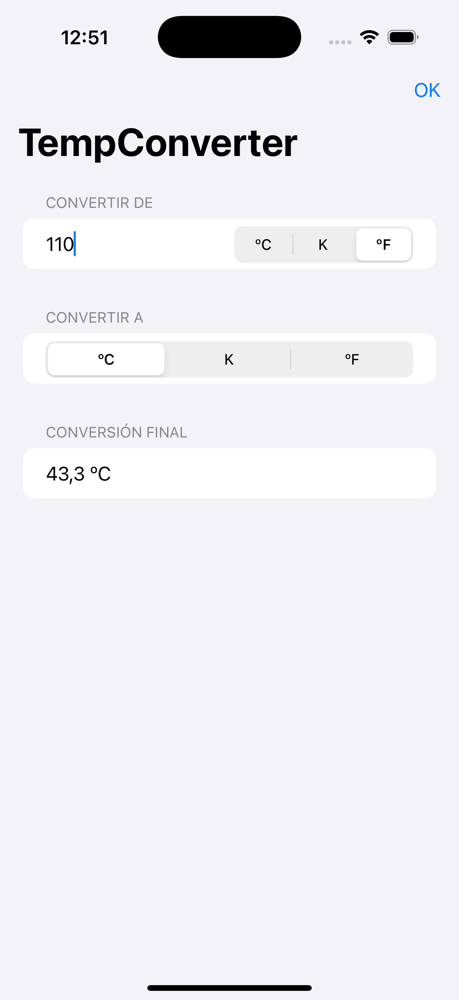 |

## 6. MultiplyApp
デザインはシンプルな香水アプリで、ユーザーは香水を表示し、香水の詳細を表示し、香水をカートに追加することができます。

## スクリーンショット

| **初期画面** | **ゲーム画面** |
|:-----------------------:|:-----------------------:|
| 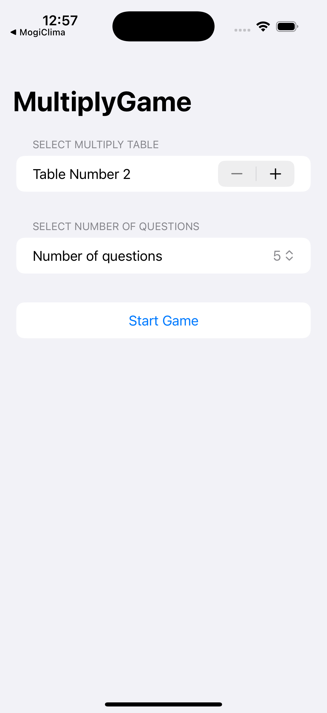 | 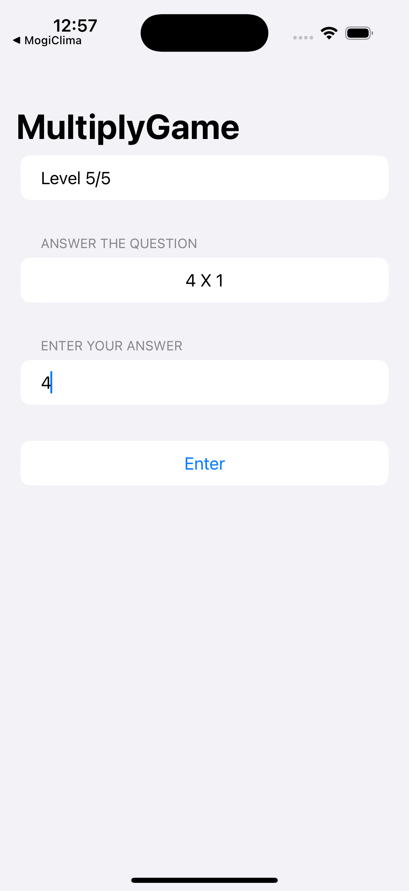 |

## 7. Moonshot
このアプリは、ユーザーが宇宙飛行士とミッションを見ることができるシンプルな宇宙飛行士ディレクトリです。

## スクリーンショット

| **ホーム画面** | **ミッションの詳細** | **宇宙飛行士の詳細** | **リストビュー** |
|:-----------------------:| :-----------------------:| :-----------------------:| :-----------------------:|
| 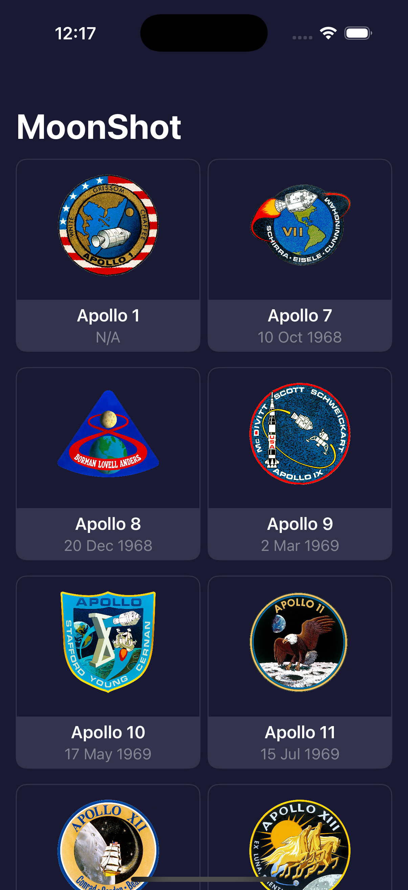 | 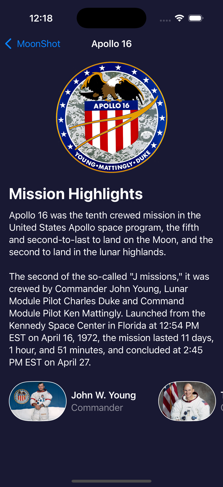 | 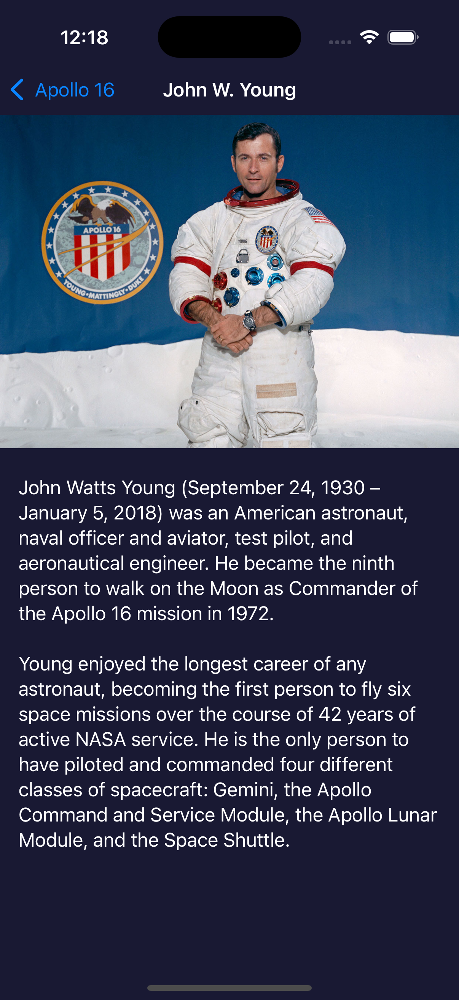 | 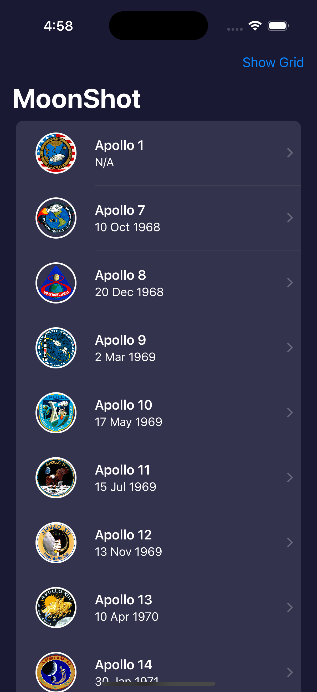 |
