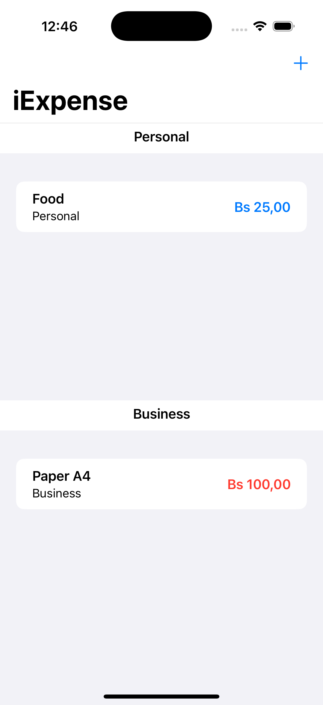
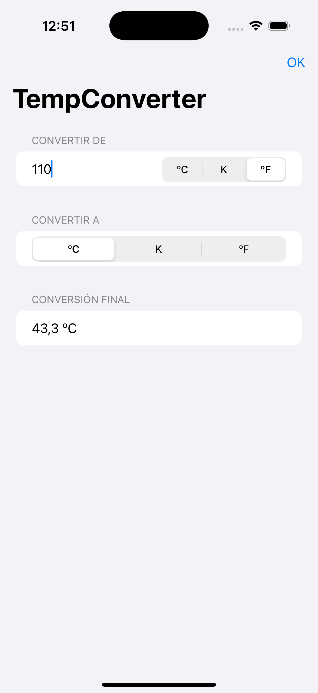
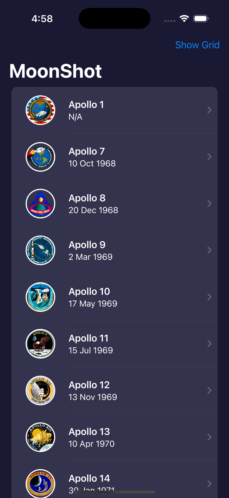

# Welcome to 100 Days of SwiftUI!

[English](./README.md) | [Español](./README.es.md) | [Français](./README.fr.md) | [日本語](./README.jp.md)
 

    
    

 

Welcome to **100 Days of SwiftUI**, where we embark on a journey to master SwiftUI together! This comprehensive challenge offers a wealth of resources, including videos, tutorials, tests, and more, all curated from my work on Hacking with Swift.

This challenge is tailored for beginners who aspire to build real iOS apps but struggle to find a suitable, free course. If you're one of them, welcome aboard! Let's dive into SwiftUI and unleash your potential in the iOS world.

Ready to get started? [Join us here!](https://www.hackingwithswift.com/100/swiftui)

## Apps

## 1. BetterRest

A simple sleep app that calculates the ideal bedtime based on wake-up time, sleep needs, and the number of coffee cups consumed..

## Screenshots

| **Home** |
|:-----------------------:|
|  |

## 2. GuessTheFlag

A simple game that challenges users to guess the flag of a country from a list of options.

## Screenshots

| **Home** |
|:-----------------------:|
|  |

## 3. iExpense

This app allows users to track their expenses and categorize them as personal or business.

## Screenshots

| ** Home ** | ** Add Expense ** |
|:-----------------------:|:-----------------------:|
|  |  | 

## 4. WordScramble

This app is a simple word game that challenges users to create words from a given word.

## Screenshots

| ** Home ** |
|:-----------------------:|
|  | 

## 5. MogiClima

This app is a simple converter that allows users to convert between Celsius and Fahrenheit.

## Screenshots

| **Home Screen** |
|:-----------------------:|
|  |

## 6. MultiplyApp

The design is a simple fragrance app that allows users to view fragrances, view fragrance details, and add fragrances to cart.

## Screenshots

| ** Initial Screen ** | ** Game Screen ** |
|:-----------------------:| :-----------------------:|
|  |  |

## 7. Moonshot

The app is a simple astronaut directory that allows users to view astronauts and missions.

## Screenshots

| **Home Screen** | **Mission Details** | **Astronaut Details** | ** List View ** |
|:-----------------------:| :-----------------------:| :-----------------------:|
|  |  |  |  |